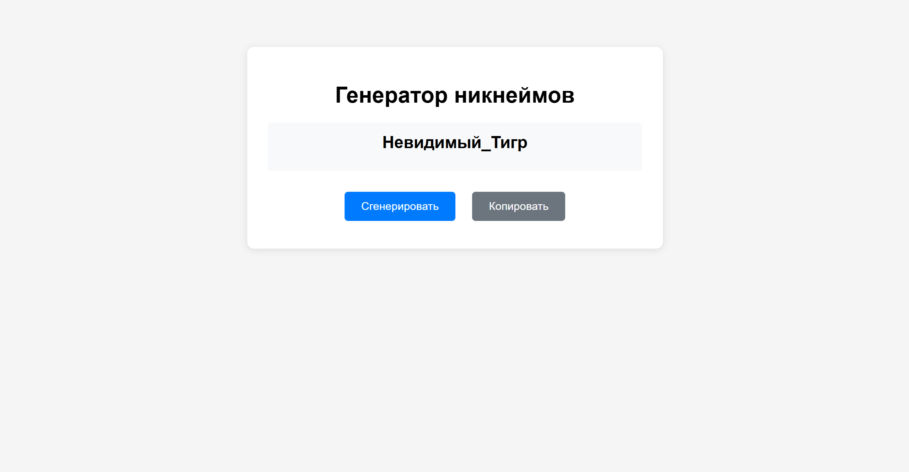

# Генератор никнеймов

Простое веб-приложение для генерации случайных никнеймов с возможностью их копирования.

## Основные возможности

- Генерация случайных никнеймов из комбинации приставок и суффиксов
- Копирование сгенерированного никнейма в буфер обмена
- Простой и интуитивно понятный интерфейс
- Адаптивный дизайн

## Особенности реализации

- **Чистый JavaScript** - без использования сторонних библиотек и фреймворков
- **HTML/CSS** - нативный код
- **Clipboard API** - способ работы с буфером обмена
- **Адаптивный дизайн** - работает на всех устройствах

## Как запустить

1. Скачайте файл `index.html`
2. Откройте его в любом современном браузере
3. Нажмите кнопку "Сгенерировать" для создания нового никнейма
4. Нажмите "Копировать" для сохранения никнейма в буфер обмена

## Скриншоты

## Выводы по выполненной работе

В ходе выполнения контрольной работы было разработано веб-приложение "Генератор никнеймов", которое:
- Успешно реализует все требуемые функции
- Демонстрирует работу с DOM, событиями и Clipboard API
- Имеет простой и понятный пользовательский интерфейс
- Не требует дополнительных зависимостей для работы